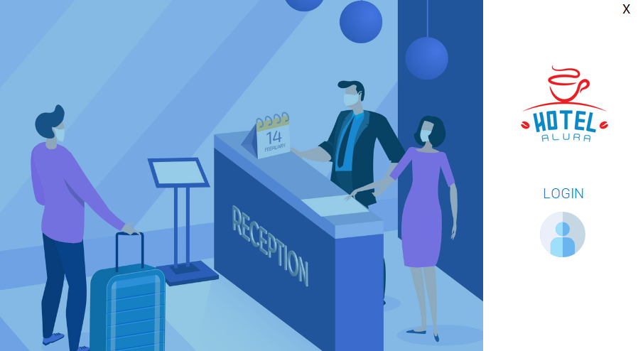

# Challenge ONE | Java | Back-end | Hotel Alura

     

---

## 🖥️ Tecnologías Utilizadas:

- Java
- Eclipse
- Biblioteca JCalendar
- MySql
- Plugin WindowBuilder  

---

### 🚧¿En qué Consiste?

 

El desafio de esta ocasión fue el desarrollo de una aplicación Desktop en Java, la cuál se encargará de gestionar a los empleados, húespedes y reservas que se realicen en el Hotel Alura.

---

### Autora:

